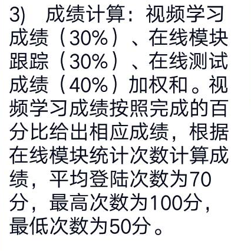
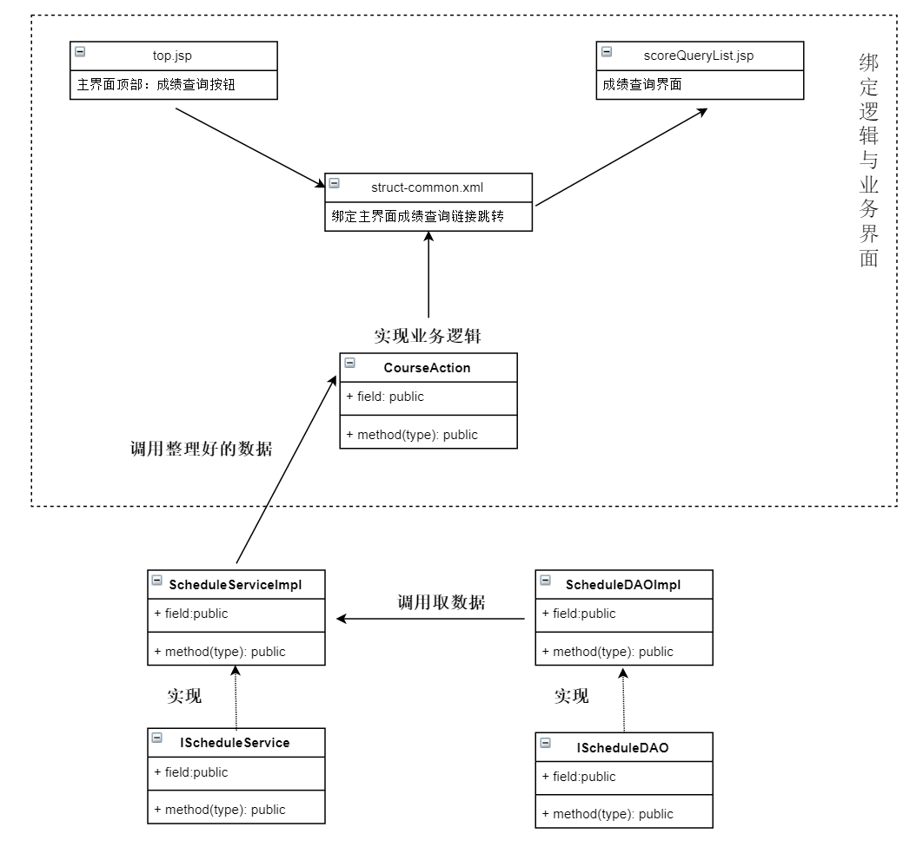

- 2019.5.13更新

### 应课程要求：需要新增加字段

### 实际修改：
- 视频分数：根据 `观看总时长/视频总时长*100`计算
- 在线模块分数: 根据`观看视频总时长`的大小计算
  - 如果该同学总时长最长，则为100分
  - 如果该同学总时长最低，则为50分
  - 如果该同学总时长高于平均时长则`(100-70)/（总时长-平均时长）* 该学生时长 + 70 `
  - 如果该同学总时长低于平均时长`(70-50)/（平均时长-0）* 该学生时长 + 50`

### 修改过程:

### 修改结果

